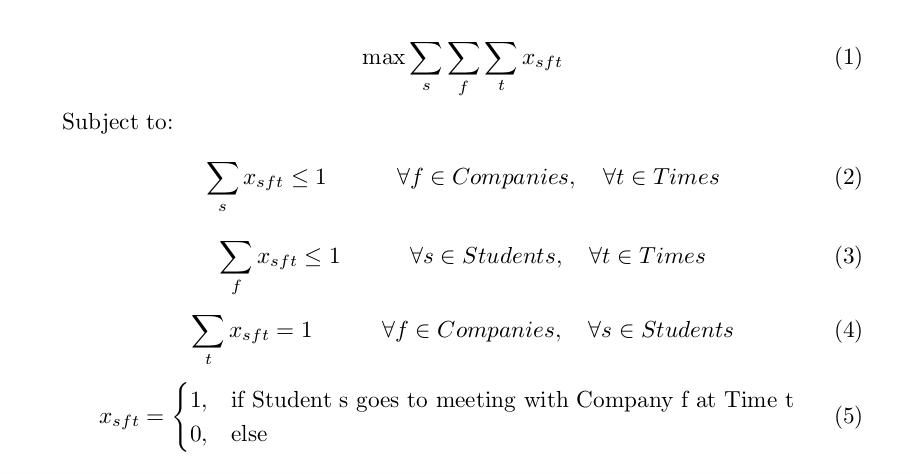

# Interview scheduling for career fair

Some career fairs have interviews during the fair day. This is typical in Sweden, where they are called "kontaktsamtal".
Since most career fairs are only one day it is hard to create a schedule that works for all companies as well as the students. 
To further complicate things, students that are chosen for one interview are usually also chosen for another, making 
it very hard to successfully schedule this. When updating one student, the errors will cascade and 
it will be a big mess. 

This optimization script solves this problem mathematically. It was used for one of the biggest student career fairs 
in Sweden and the schedule had no errors. Before this script two people would spend 20h+ a few days before 
the fair to get an "ok" schedule. If a solution exists where all students can have an interview with 
all the companies that have selected them then this script will find it. 

## The problem
The problem can be summarized as the following optimization model:

## The code
### Generate tuple
To solve the model a tuple of the possible interview times is needed. 
This tuple is generated by generatetuple.py

See example data in the generatetuple.py

### Scheduling
The above mentioned model has been implemented with gurobi and python. It is in scheduling.py. 
The tuple is needed for the model and then it solves the problem, and saves the solution schedule as a csv file.

### Dependencies
This problem was solved using Gurobi (https://www.gurobi.com/). It is an optimization solver. It is free for academic use. 

## Future
This model is proven to work and no future development is needed. 
However, if you have any questions about it feel free to raise an issue and I will answer your question. 
I can not help you with installing Gurobi, it can be a bit messy but just power through! 

## License
GPLv3
